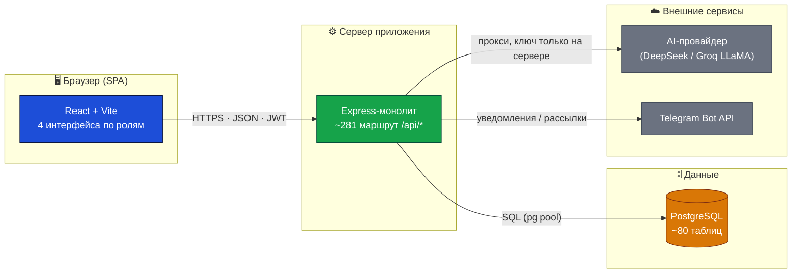
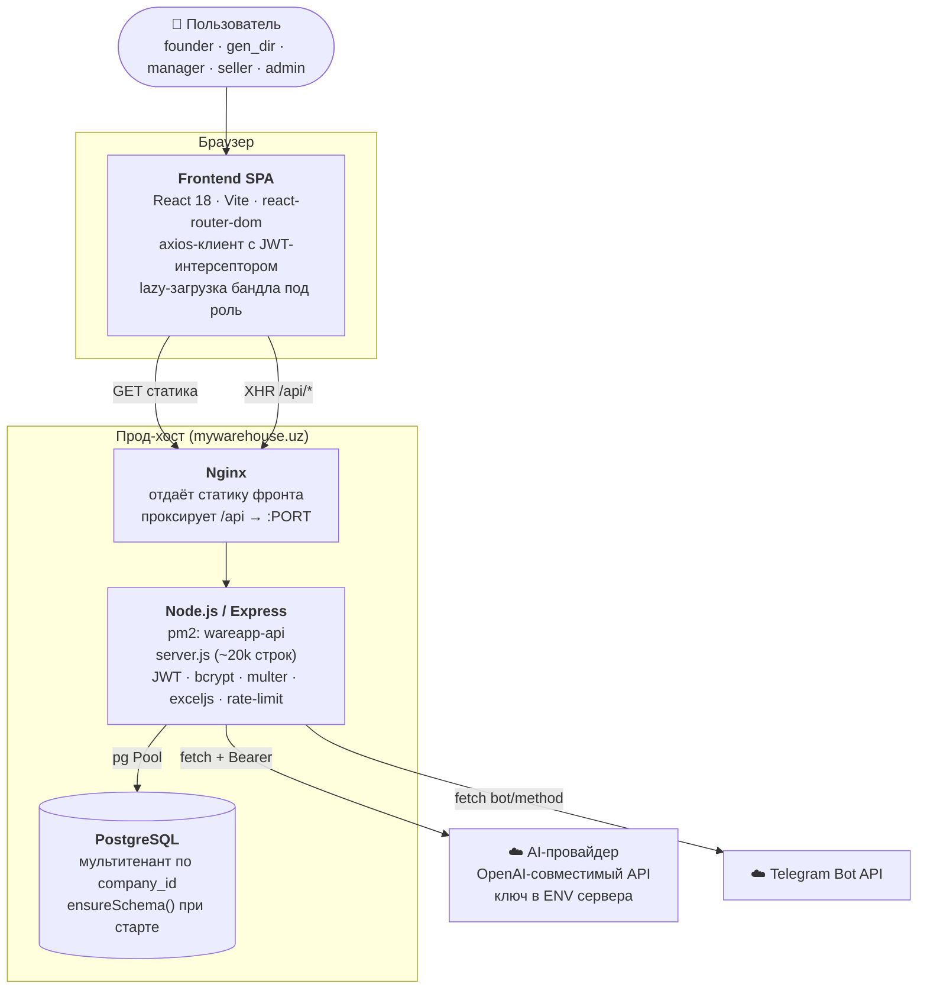
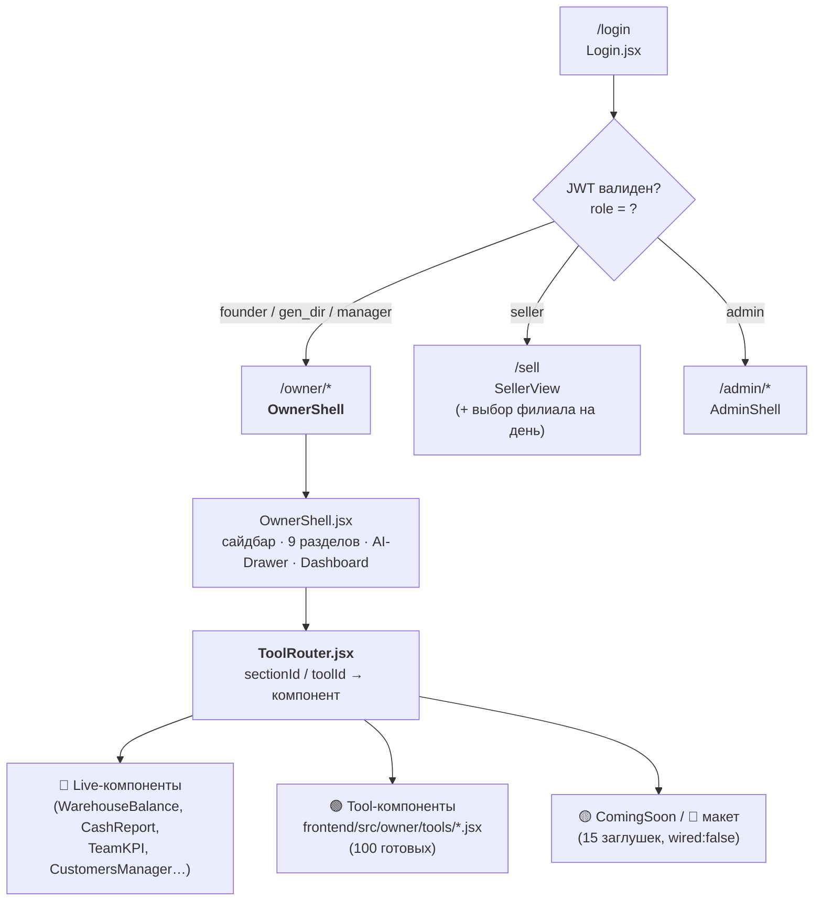
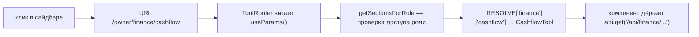
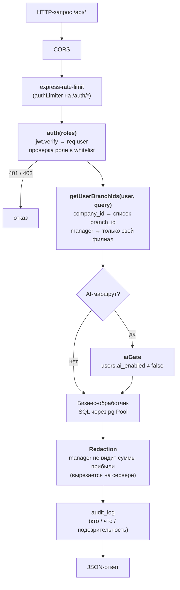
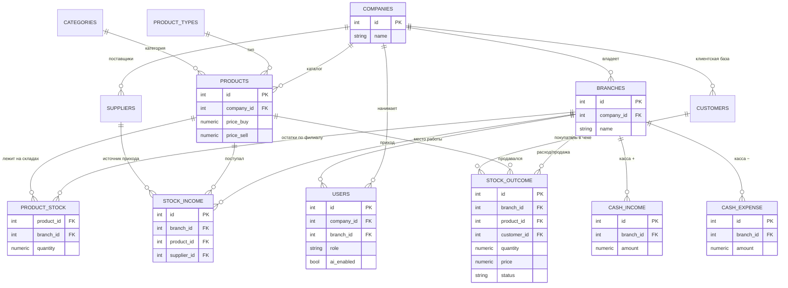
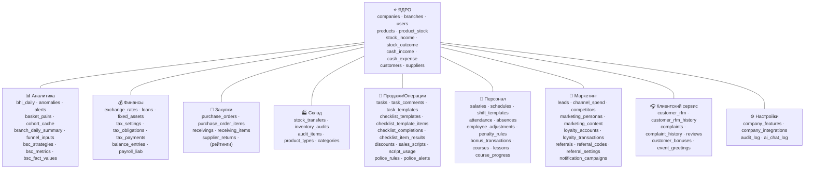
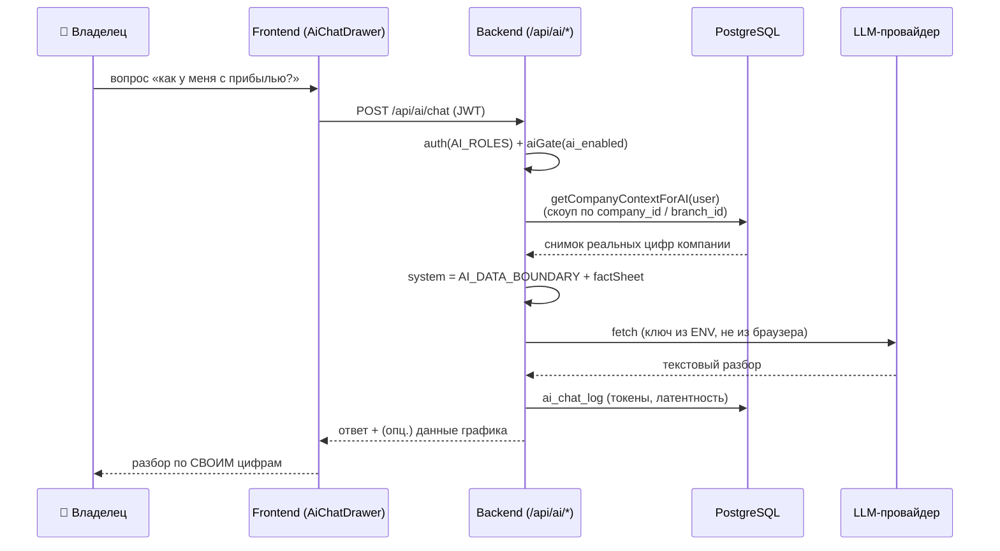
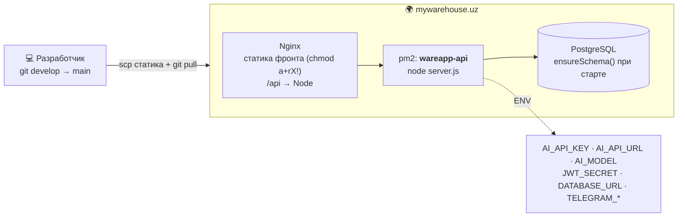

# 🌊 Wave ERP — Архитектура системы

> Единый документ для **Product Manager** и **System Engineer**.
> Описывает, как устроены Frontend ↔ Backend ↔ Database, как 115 инструментов панели владельца ложатся на API и таблицы, и какие сквозные принципы (мультитенантность, роли, AI-граница данных) удерживают всё вместе.

**Стек:** React 18 + Vite (SPA) · Node.js + Express (монолит) · PostgreSQL · внешний AI-провайдер (OpenAI-совместимый) · Telegram Bot API.
**Масштаб на сегодня:** 115 инструментов в 9 разделах · ~281 HTTP-маршрут · ~80 таблиц БД · 5 ролей пользователей.

---

## 1. Обзор за 30 секунд (для PM)

Wave ERP — это **облачная ERP для розницы** (мультикомпанийная, мультифилиальная). Один владелец (`founder`) заводит компанию, внутри неё — филиалы, в филиалах работают продавцы. Над всем — панель владельца со 115 инструментами: аналитика, финансы, закупки, склад, продажи, персонал, маркетинг, клиентский сервис, настройки. Поверх данных работает встроенный **AI-аналитик**, который отвечает **только по цифрам конкретной компании**.



**Главный архитектурный принцип:** браузер никогда не ходит в БД и к AI напрямую. Всё проходит через backend, который проверяет токен, роль и **обрезает данные по `company_id` / `branch_id`** прежде чем что-либо вернуть.

---

## 2. Контейнерная диаграмма (C4 — уровень 2)

Что физически развёрнуто и как взаимодействует.



| Контейнер | Технология | Ответственность | Где в репо |
|---|---|---|---|
| **Frontend SPA** | React 18, Vite, react-router-dom, axios | UI, роутинг по ролям, рендер 115 инструментов | [frontend/src/](../frontend/src/) |
| **Backend API** | Node.js, Express (монолит) | Аутентификация, RBAC, бизнес-логика, скоупинг данных, AI-прокси | [backend/server.js](../backend/server.js) |
| **Database** | PostgreSQL (драйвер `pg`) | Хранение всех данных, мультитенант по `company_id` | схема в `ensureSchema()` + [migrations/001_init.sql](../backend/migrations/001_init.sql) |
| **AI-провайдер** | DeepSeek / Groq (внешний) | LLM-разбор по реальным цифрам компании | прокси в `server.js` (`/api/ai/*`) |
| **Telegram** | Bot API (внешний) | Уведомления, клиентские рассылки | `fetch` к `api.telegram.org` |

---

## 3. Frontend — маршрутизация по ролям

Точка входа [App.jsx](../frontend/src/App.jsx) проверяет JWT (`/auth/me`) и разводит пользователя по «оболочке» (shell), соответствующей роли. Каждая оболочка **грузится лениво** — продавец не качает бандл владельца, и наоборот.



**Как инструмент находит свой UI** ([modules.js](../frontend/src/owner/modules.js) + [ToolRouter.jsx](../frontend/src/owner/ToolRouter.jsx)):

1. `modules.js` — **единственный источник правды** по составу панели: массив `SECTIONS` описывает 9 разделов и каждый инструмент (`id`, `title`, `icon`, `wired`, `roles`).
2. `getSectionsForRole(role)` фильтрует разделы и инструменты по роли (например, `salaries` видят только `founder`/`gen_dir`).
3. URL `/owner/:sectionId/:toolId` попадает в `ToolRouter`, который по таблице `RESOLVE[sectionId][toolId]` подбирает React-компонент.
4. Если `wired:false` или компонента нет — рендерится баннер «🚧 Дизайн-макет» или `ComingSoon`.



> **Для PM:** добавить новый инструмент = (1) строка в `modules.js`, (2) компонент в `tools/`, (3) запись в `RESOLVE`. Backend-эндпоинт — отдельно. Поэтому «заглушка» = пункт в меню есть, а строки в `RESOLVE`/реальных данных ещё нет.

---

## 4. Backend — слои обработки запроса

Монолит, но с чёткой **цепочкой middleware**. Любой запрос к `/api/*` проходит одни и те же ворота, прежде чем дойти до бизнес-логики.



**Сквозные механизмы безопасности (system engineer):**

| Механизм | Где | Что делает |
|---|---|---|
| **JWT-аутентификация** | `auth(roles)` middleware | `jwt.verify`, кладёт `req.user`, отбивает по роли |
| **Мультитенантность** | `getUserBranchIds()` | Всё скоупится по `company_id`; чужие компании недостижимы |
| **Филиальная изоляция** | тот же helper | `manager` видит только `branch_id`, к которому привязан |
| **Redaction** | в обработчиках | Менеджеру не отдаются суммы прибыли/выручки компании |
| **AI-гейт** | `aiGate` | Владелец может отключить AI конкретному пользователю |
| **Аудит** | `audit_log` + helper | Логирует действия, помечает подозрительные |
| **Rate limiting** | `express-rate-limit` | Защита `/auth/*` от перебора |
| **Хэш паролей** | `bcryptjs` | Пароли только в виде хэша |

**API-поверхность по разделам** (≈281 маршрут, топ-префиксы):

| Раздел панели | API-префиксы | ~маршрутов |
|---|---|---|
| 📊 Аналитика | `/api/analytics` · `/api/bhi` · `/api/bsc` | ~24 |
| 💰 Финансы | `/api/finance` · `/api/cash` · `/api/pricing` | ~29 |
| 🛒 Закупки | `/api/procurement` · `/api/suppliers` | ~22 |
| 🏭 Склад | `/api/warehouse` · `/api/stock` · `/api/products` · `/api/types` · `/api/categories` · `/api/inventory` | ~50 |
| 💼 Продажи / Операции | `/api/sales` · `/api/operations` · `/api/tasks` · `/api/task-templates` · `/api/checklists` · `/api/discounts` · `/api/police` | ~25 |
| 👥 Персонал (HR) | `/api/hr` · `/api/shifts` · `/api/team` · `/api/users` | ~37 |
| 📣 Маркетинг | `/api/marketing` | ~23 |
| 🎧 Клиентский сервис | `/api/crm` · `/api/customers` · `/api/nps` · `/api/debts` | ~30 |
| ⚙️ Настройки | `/api/integrations` · `/api/companies` · `/api/company` · `/api/admin` · `/api/audit-log` · `/api/role-change-log` · `/api/settings` | ~20 |
| 🤖 AI (сквозной) | `/api/ai` (chat · analyze · chart-data · suggest) | 5 |
| 🔐 Платформа | `/api/auth` · `/api/branches` · `/api/me` · `/api/health` · `/api/upload` | ~20 |

---

## 5. Entity-Relationship — модель данных

PostgreSQL, ~80 таблиц. Чтобы диаграмма читалась, разделяем её на **транзакционный «хребет»** (то, вокруг чего крутится всё) и **модульные кластеры** (таблицы конкретных инструментов).

### 5.1 Ядро (транзакционный хребет)



> **Ключевой факт для инженера:** `stock_outcome` (продажи/расход) — самая горячая таблица: 162 обращения в коде. Вся выручка/прибыль/маржа считается как `SUM(quantity*price)` с `JOIN products` ради себестоимости (`price_buy`). Фильтр `status='approved'` отсекает черновики. `company_id` на `products` — второй замок: данные другой компании не подтянутся даже через филиал.

### 5.2 Модульные кластеры (какие таблицы за каким разделом)

Каждый раздел панели опирается на ядро **плюс** свои таблицы. Ниже — карта «раздел → его таблицы».



| Раздел | Опорные таблицы (сверх ядра) |
|---|---|
| 📊 **Аналитика** | `bhi_daily`, `anomalies`, `alerts`, `basket_pairs`, `cohort_cache`, `branch_daily_summary`, `funnel_inputs`, `bsc_strategies/metrics/fact_values/departments` |
| 💰 **Финансы** | `exchange_rates`, `loans`, `fixed_assets`, `tax_settings/obligations/payments`, `balance_entries`, `payroll_liab` |
| 🛒 **Закупки** | `purchase_orders` + `purchase_order_items`, `receivings` + `receiving_items`, `supplier_returns` |
| 🏭 **Склад** | `stock_transfers`, `inventory_audits` + `audit_items`, `product_types`, `categories` |
| 💼 **Продажи / Операции** | `tasks` + `task_comments` + `task_templates`, `checklist_templates/template_items/completions/item_results`, `discounts`, `sales_scripts` + `script_usage`, `police_rules` + `police_alerts` |
| 👥 **Персонал (HR)** | `salaries`, `schedules`, `shift_templates`, `attendance`, `absences`, `employee_adjustments`, `penalty_rules`, `bonus_transactions`, `courses` + `lessons` + `course_progress` |
| 📣 **Маркетинг** | `leads`, `channel_spend`, `competitors`, `marketing_personas`, `marketing_content`, `loyalty_accounts` + `loyalty_transactions`, `referrals` + `referral_codes` + `referral_settings`, `notification_campaigns` |
| 🎧 **Клиентский сервис** | `customer_rfm` + `customer_rfm_history`, `complaints` + `complaint_history`, `reviews`, `customer_bonuses`, `event_greetings` |
| ⚙️ **Настройки** | `company_features`, `company_integrations`, `audit_log`, `ai_chat_log` |

---

## 6. AI-слой — «граница данных»

AI встроен как **аналитик поверх данных компании**, а не как чат с интернетом. Ключевые гарантии:



**Что важно (system engineer):**
- **Ключ AI только в ENV сервера** (`AI_API_KEY`) — в браузер не уходит, backend выступает прокси. Провайдер переключается через `AI_API_URL` / `AI_MODEL` (DeepSeek по умолчанию, можно Groq LLaMA).
- **`getCompanyContextForAI(user)`** строит снимок: lifetime-выручка/прибыль/сделки, текущие 30 дней vs предыдущие, помесячный тренд за 24 мес, топ-товары/продавцы, остатки, долги — **всё отфильтровано по `company_id`**, а для `manager` — по его `branch_id`.
- **`AI_DATA_BOUNDARY`** — системная инструкция: отвечать **только** по приведённым цифрам, не выдумывать.
- **`/api/ai/analyze`** не доверяет числам от клиента: пересчитывает их **на сервере** теми же функциями, что и обычные эндпоинты (`computeCashflow`, `computeBreakEven`, `computeFinModel`, `computeChannels`), и только потом просит LLM дать разбор + 2-3 действия.
- **`ai_chat_log`** фиксирует расход токенов и латентность для контроля стоимости.

---

## 7. Сквозной поток: «клик → данные на экране»

Полный путь одного инструмента (на примере «Финансы → Cash Flow») — связывает все три слоя.

```mermaid
sequenceDiagram
    autonumber
    participant U as 👤 founder
    participant SPA as Frontend (CashflowTool)
    participant AX as api.js (axios)
    participant NG as Nginx
    participant EX as Express
    participant MW as auth + scope (middleware)
    participant PG as PostgreSQL

    U->>SPA: открывает /owner/finance/cashflow
    SPA->>SPA: ToolRouter → RESOLVE['finance']['cashflow']
    SPA->>AX: api.get('/api/finance/cashflow')
    AX->>AX: интерсептор: + Authorization Bearer JWT
    AX->>NG: GET /api/finance/cashflow
    NG->>EX: проксирует на Node
    EX->>MW: auth(['founder','gen_dir','manager'])
    MW->>MW: jwt.verify → req.user; getUserBranchIds()
    MW->>PG: SQL по branch_id ∈ company_id
    PG-->>EX: строки cash_income / cash_expense
    EX->>EX: агрегация + redaction по роли
    EX-->>SPA: JSON {income, expense, balance, forecast}
    SPA-->>U: график и цифры Cash Flow
```

---

## 8. Деплой (prod-топология)



**Подводные камни эксплуатации (из практики проекта):**
- После `scp` фронта **обязательно** `chmod -R a+rX` на каталоге — иначе Nginx отдаёт `403`.
- `ensureSchema()` идёт одним `try/catch`: таблицы, принадлежащие пользователю `postgres` (например `audit_log`, `bhi_daily`), могут уронить миграцию прав — следить за владельцем таблиц.
- Демо-данные: `backend/seed_demo.js` (обратимый, помечает `[SEED]`) оживляет дашборд; `backend/harness.js` — 64 проверки всех окон. Компания `id=1` = демо.

---

## 9. Карта репозитория (навигация)

| Путь | Что внутри |
|---|---|
| [frontend/src/App.jsx](../frontend/src/App.jsx) | Роутинг по ролям, проверка JWT, ленивые оболочки |
| [frontend/src/api.js](../frontend/src/api.js) | axios-клиент: JWT-интерсептор, авто-`branch_id` для продавца, 401→logout |
| [frontend/src/owner/OwnerShell.jsx](../frontend/src/owner/OwnerShell.jsx) | Оболочка владельца: сайдбар, разделы, AI-drawer, дашборд |
| [frontend/src/owner/modules.js](../frontend/src/owner/modules.js) | **Источник правды** по 9 разделам и 115 инструментам |
| [frontend/src/owner/ToolRouter.jsx](../frontend/src/owner/ToolRouter.jsx) | `RESOLVE`: маппинг `section/tool → React-компонент` |
| [frontend/src/owner/tools/](../frontend/src/owner/tools/) | Компоненты инструментов (100 готовых + макеты) |
| [frontend/src/components/](../frontend/src/components/) | Live-компоненты на реальных данных (склад, касса, KPI, CRM) |
| [backend/server.js](../backend/server.js) | Монолит: middleware, ~281 маршрут, `ensureSchema()`, AI-прокси |
| [backend/migrations/001_init.sql](../backend/migrations/001_init.sql) | Базовые таблицы ядра |
| [backend/seed_demo.js](../backend/seed_demo.js) · [backend/harness.js](../backend/harness.js) | Демо-сидер и проверочный харнесс |

---

### Легенда статусов инструментов
🟢 **Готов** (`wired:true`) — реальные данные из API · 🟡 **Заглушка** (`wired:false`) — пункт меню есть, данные/`RESOLVE` ещё нет (15 шт.).

*Документ отражает состояние ветки `develop` и опирается на код, а не на предположения. При изменении `modules.js`, `RESOLVE` или схемы БД — обновляйте соответствующие разделы.*
